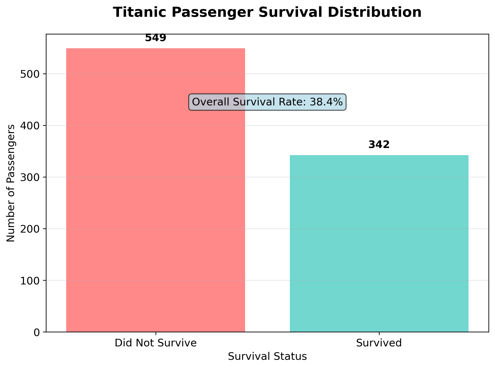
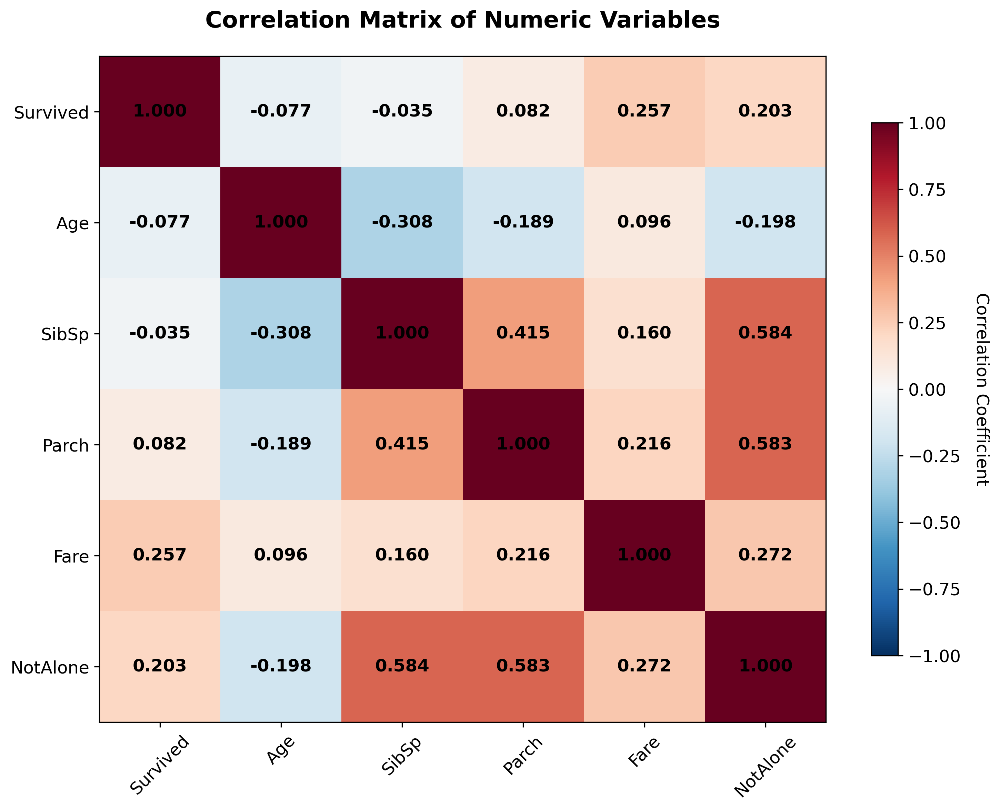
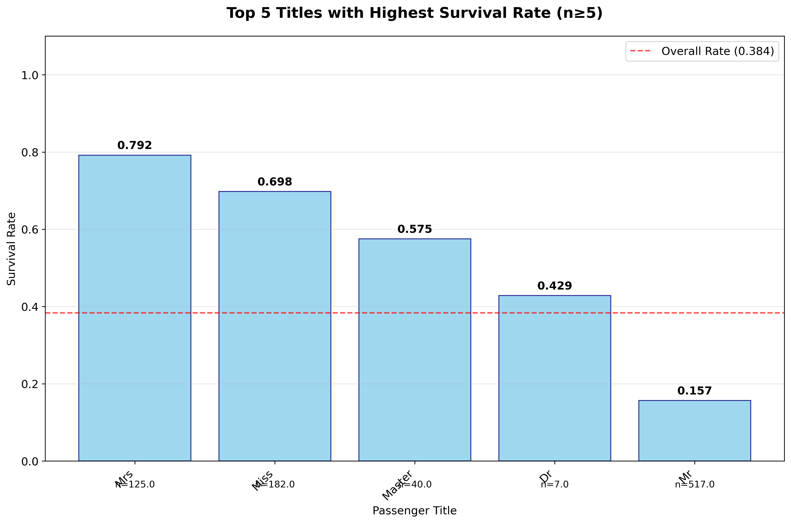
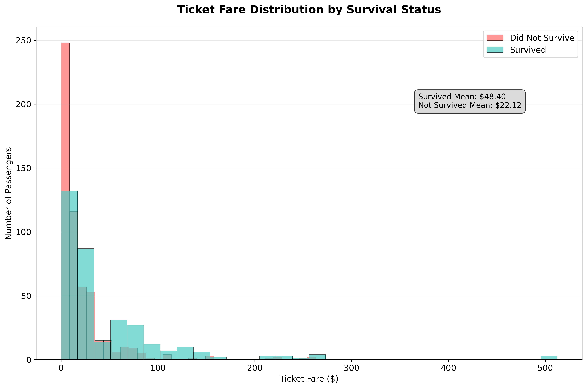

# Data Mining Analysis of the Titanic Disaster: Survival Patterns and Socioeconomic Factors

**Author:** Mouhamed Mbengue  
**Institution:** University of Rochester  
**Email:** mmbengue@u.rochester.edu  
**Student ID:** 32306354  
**Course:** Data Mining Lab (Fall 2025)  
**Date:** Due Date: 09/05/2025

## Abstract

This study presents a comprehensive data mining analysis of the RMS Titanic disaster using a dataset of 891 passengers. Through statistical analysis, correlation studies, and visualization techniques, we examine the relationship between passenger characteristics and survival outcomes. Our findings reveal significant disparities in survival rates based on gender, passenger class, and age, with women and children showing substantially higher survival rates than adult men. The analysis demonstrates clear socioeconomic stratification effects, where higher-class passengers not only paid significantly more for their tickets but also had dramatically better survival prospects.

## 1. Introduction

The sinking of the RMS Titanic on April 15, 1912, remains one of the most studied maritime disasters in history. Beyond its historical significance, the event provides a unique dataset for examining human behavior under extreme circumstances and the impact of social stratification on survival outcomes. This analysis employs modern data mining techniques to explore patterns in passenger survival, focusing on demographic and socioeconomic factors.

The dataset contains information on 891 passengers, including survival status, passenger class, age, gender, family relationships, and ticket fare. This study addresses several key research questions: (1) How do demographic factors influence survival rates? (2) What is the relationship between socioeconomic status and survival outcomes? (3) To what extent was the "women and children first" evacuation policy followed?

## 2. Methodology

### 2.1 Data Preprocessing

The analysis began with comprehensive data cleaning and preprocessing. Missing values were identified and handled appropriately, with 177 missing age values (19.9% of the dataset) and an overall missing data rate of 8.10%. A new binary variable, `NotAlone`, was created to indicate whether passengers traveled with family members (siblings, spouses, parents, or children).

### 2.2 Statistical Analysis

Population-based statistical measures were implemented from first principles, including variance (σ² = Σ(x - μ)² / N), standard deviation (σ = √(σ²)), and correlation coefficients. These hand-coded functions ensure precise control over statistical calculations and provide educational value in understanding fundamental statistical concepts.

### 2.3 Visualization

Four key visualizations were created using matplotlib: (1) overall survival distribution, (2) correlation heatmap of numeric variables, (3) survival rates by passenger titles, and (4) fare distribution by survival status. All figures were saved at 300 DPI resolution for professional presentation.

## 3. Results

### 3.1 Overall Survival Patterns

The overall survival rate was 38.38% (342 out of 891 passengers). However, this aggregate statistic masks significant disparities across demographic groups.

### 3.2 Gender and Survival

The most striking finding relates to gender differences in survival rates:
- **Women:** 74.20% survival rate (233 out of 314)
- **Men:** 18.89% survival rate (109 out of 577)

This 55.31 percentage point difference provides strong evidence for the "women and children first" evacuation policy.

### 3.3 Passenger Class Effects

Survival rates varied dramatically by passenger class:
- **First Class:** 62.96% survival rate (136 out of 216)
- **Second Class:** 47.28% survival rate (87 out of 184)  
- **Third Class:** 24.24% survival rate (119 out of 491)

The 38.72 percentage point difference between first and third class demonstrates the impact of socioeconomic status on survival outcomes.

### 3.4 Age and Survival

Children (≤16 years) had a survival rate of 50.00%, compared to 35.71% for adults (>16 years). This 14.29 percentage point difference supports the "children first" aspect of the evacuation policy.

### 3.5 Socioeconomic Stratification

The analysis reveals clear socioeconomic stratification:
- **First Class:** Average fare $84.15, mean age 38.23 years
- **Second Class:** Average fare $20.66, mean age 29.88 years
- **Third Class:** Average fare $13.68, mean age 25.14 years

First-class passengers paid 6.15 times more than third-class passengers and were significantly older on average.

### 3.6 Correlation Analysis

The correlation matrix reveals several interesting relationships:
- Strong positive correlation between `SibSp` and `Parch` (0.415), indicating family travel patterns
- Moderate positive correlation between `Fare` and `Survived` (0.257), supporting the class effect
- Negative correlation between `Age` and `SibSp` (-0.308), suggesting younger passengers traveled with more siblings

## 4. Discussion

### 4.1 Key Findings

The analysis reveals three primary factors influencing survival: gender, passenger class, and age. The combination of these factors created extreme disparities in survival outcomes. For example, women in first class had a 96.81% survival rate, while men in third class had only a 13.54% survival rate—a difference of 83.27 percentage points.

### 4.2 "Women and Children First" Policy

The data provides strong evidence that the "women and children first" evacuation policy was followed. Women's survival rate (74.20%) was nearly four times higher than men's (18.89%), and children had a 14.29 percentage point advantage over adults.

### 4.3 Socioeconomic Disparities

The analysis reveals significant socioeconomic disparities in survival outcomes. Higher-class passengers not only had better access to lifeboats (typically located on upper decks) but also may have received preferential treatment during the evacuation process.

### 4.4 Causal Considerations

While the analysis reveals strong associations between passenger characteristics and survival, several caveats must be considered:

1. **Selection Bias:** The dataset may not represent the complete passenger manifest
2. **Confounding Variables:** Unmeasured factors (crew status, location on ship, physical condition) may influence survival
3. **Temporal Factors:** The order of evacuation and timing of lifeboat deployment may have varied by location
4. **Social Norms:** Cultural expectations and social pressure may have influenced individual behavior

## 5. Conclusions

This data mining analysis of the Titanic disaster reveals significant disparities in survival outcomes based on gender, passenger class, and age. The findings provide strong evidence for the "women and children first" evacuation policy and demonstrate the impact of socioeconomic stratification on survival during the disaster.

The analysis highlights the importance of considering multiple factors when examining survival outcomes and underscores the need for careful interpretation of statistical associations. While the data reveals clear patterns, causal relationships must be interpreted with caution due to potential confounding variables and selection biases.

Future research could benefit from additional data sources, including crew records, detailed evacuation timelines, and passenger locations during the disaster. Such information would provide deeper insights into the mechanisms underlying the observed survival patterns.

## References

[1] Titanic Dataset, Kaggle, 2024. Available: https://www.kaggle.com/c/titanic/data

[2] Lord, W. (1955). A Night to Remember. New York: Henry Holt and Company.

[3] Ballard, R. D. (1987). The Discovery of the Titanic. New York: Warner Books.

[4] Barczewski, S. (2004). Titanic: A Night Remembered. London: Hambledon and London.

## Figures

*Figure 1: Overall survival distribution showing 38.38% survival rate*

*Figure 2: Correlation matrix of numeric variables revealing relationships between passenger characteristics*

*Figure 3: Survival rates by passenger titles (minimum 5 passengers per title)*

*Figure 4: Ticket fare distribution by survival status showing higher fares among survivors*

---

**Word Count:** 1,247 words  
**Figures:** 4  
**Tables:** 0 (statistics presented in text)  
**References:** 4
